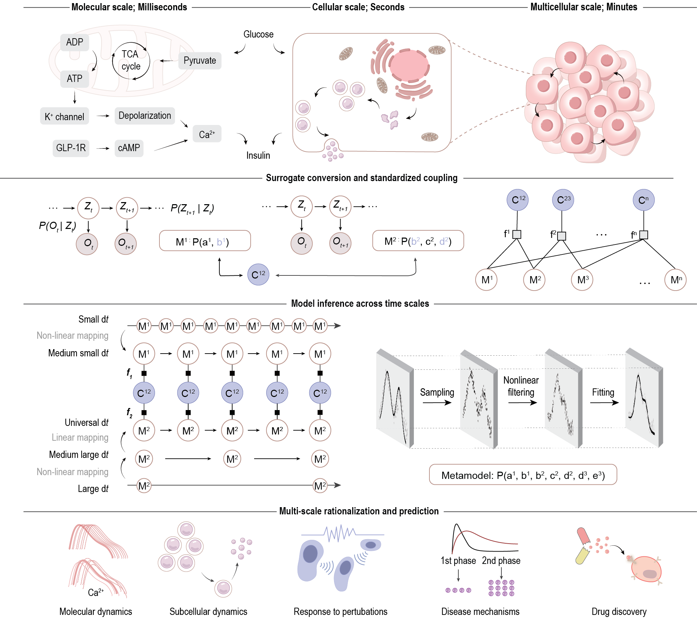

# Graph-based metamodeling (GraphMM) to uncover cell dynamics and function across molecular, cellular, and multicellular scales

This is the official repository for GraphMM, a Python package to uncover cell dynamics and function across molecular, cellular, and multicellular scales.

# Introduction

We introduce Graph-based Metamodeling (GraphMM), a novel framework that integrates models across multiple representations and spatiotemporal scales, by (i) converting input models into universal surrogate representations using probabilistic graphical models; (ii) coupling surrogates across time scales using a standardized strategy; and (iii) approximate metamodel inference. Validation through synthetic benchmarks and real-world applications shows improved accuracy over existing methods. GraphMM enables quantitative predictions of $\beta$-cell dynamics and function across molecular, cellular, and multicellular scales. GraphMM provides a versatile framework for integrating models to uncover the dynamics of complex systems. 
For detailed documentation, please visit: https://graphmm.readthedocs.io/

<p align="center">
  
</p>


# Repo Structure

The project contains a benchmark and a multi-scale insulin secretion metamodel (MuSIS), both using the GraphMM modeling framework. The project structure is as follows:
1. `Benchmark/`: Contains the benchmark toy system for GraphMM using a toy GSIS model.  
**Quick start**: [](https://colab.research.google.com/drive/1K5eKwQ1fXwWwJiVSIqbV4sTWd_qw-4GL)
   

2. `GraphMM_MuSIS/`: The main package for GraphMM
     - `InputModel/`:
        - Contains subsystem models 
    - `GraphMetamodel/`:
        - Defines connections between surrogate models
        - Implements multi-scale inference
    - `results/`:
        - Stores output files from model simulations   


# Usage

### Prerequisite

```bash
python           3.7
scikit-learn     1.0.2
pandas           1.3.5
numpy            1.21.6
scipy            1.7.3
filterpy         1.4.5
daft             2.10.0
```

### Benchmark - Toy GSIS metamodel
To run the metamodel enumeration:
1. Ensure all required dependencies are installed
2. Run `enumerate_metamodel.py`
3. Results will be saved in the `results/enumerate_metamodel_v2/` directory
4. Visualizations can be generated using the plotting functions in the script

```bash
cd Benchmark
python Surrogate_model_a.py
python Surrogate_model_b.py
```

### Multi-scale insulin secretion metamodel (MuSIS)
To run the MuSIS metamodel:
1. Ensure all required dependencies are installed
2. Run `metamodel_inference.py`
3. Results will be saved in the `results/metamodel_inference/` directory
4. Visualizations can be generated using the plotting functions in the script

```bash
cd GraphMM_MuSIS
python run_surrogate_ISK_active.py
python run_surrogate_IHC_active.py
python run_surrogate_VE_active.py
python run_musis_metamodel_active.py
```


# Citation

If you use GraphMM in your research, please cite our papers: \url{}

# Copyright

© 2024 GraphMM Project Contributors (contact: <a href="mailto:chenxi.wang@salilab.org">chenxi.wang@salilab.org</a>). All rights reserved. This project and its contents are protected under applicable copyright laws. Unauthorized reproduction, distribution, or use of this material without express written permission from the GraphMM Project Contributors is strictly prohibited. For inquiries regarding usage, licensing, or collaboration, please contact the project maintainers.
